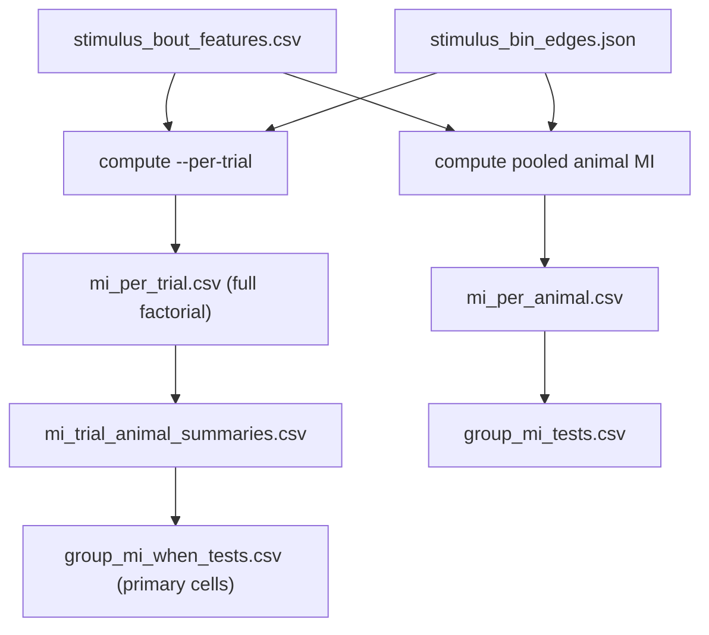

# Stimulus MI — when is coupling real (trial + ordinal exposure)

## Goal

Answer “when along experience is stimulus↔syllable coupling present, and does that timing differ by sex / genotype / tx?” without reopening mixed models or replacing the pooled animal pilot.

Grill closed 2026-07-09. ADR: [docs/adr/0006-stimulus-mi-trial-trajectory-not-mixed.md](../../docs/adr/0006-stimulus-mi-trial-trajectory-not-mixed.md).

## Locked decisions (do not relitigate)

| Topic | Decision |
|-------|----------|
| Grain | **Trial** MI + **ordinal exposure** (`trial_ord` primary, `cum_run_bouts` secondary) |
| “Real” | Continuous **excess** (`mi_mm − null_circ_mean`) for analysis when nulls on; binary `null_circ_p < α` annotation only |
| `trial_ord` | Parse numeric suffixes from `session` / `trial`; fail-fast if unparseable |
| Early/late | **Career:** first/last **k=3** on `trial_ord` (all sessions); require **N ≥ 6**; delta = **mean(early) − mean(late)** on `mi_mm` (+ excess if nulls). **Within-session:** same k per session (\(N_{sess}≥6\)), animal scalar = mean of session deltas (`early_late_delta_within_session`); see sliced-factorial grill / plan |
| Strata×when | Animal-level **OLS slope** + **early_late_delta**; Mann–Whitney/Kruskal — **no** trial-level mixed model |
| Primary claims | `run × {duty, dist} × occupancy` only for when-tests |
| Trial CSV | **Full factorial** `phase × stim_var × mi_type` |
| Gates | Default **emit all trials**; optional `--min-run-bouts` / `--min-h-stim` |
| Bins | Reuse cohort-global `stimulus_bin_edges.json` (manual edits allowed; pass via existing load path) |
| Pooled | Keep `mi_per_animal.csv` / `group_mi_tests.csv`; `--per-trial` is **additive** |
| Nulls | Default: no per-trial p; `--trial-nulls` → circular, **n_perm=200** |
| Slopes | Default OLS of **`mi_mm` ~ trial_ord**; also excess slope when `--trial-nulls` |
| CLI | Extend `maze-compute-stimulus-mi` |
| Artifacts | `mi_per_trial.csv`, `mi_trial_animal_summaries.csv`, `group_mi_when_tests.csv` |

## Data flow

## Out of scope

Mixed-effects time×strata; calendar-session as primary x (session still used to order); MI alphabet = n-grams/Behavior (ethogram track); probe/omission dissociation of duty vs proximity.
