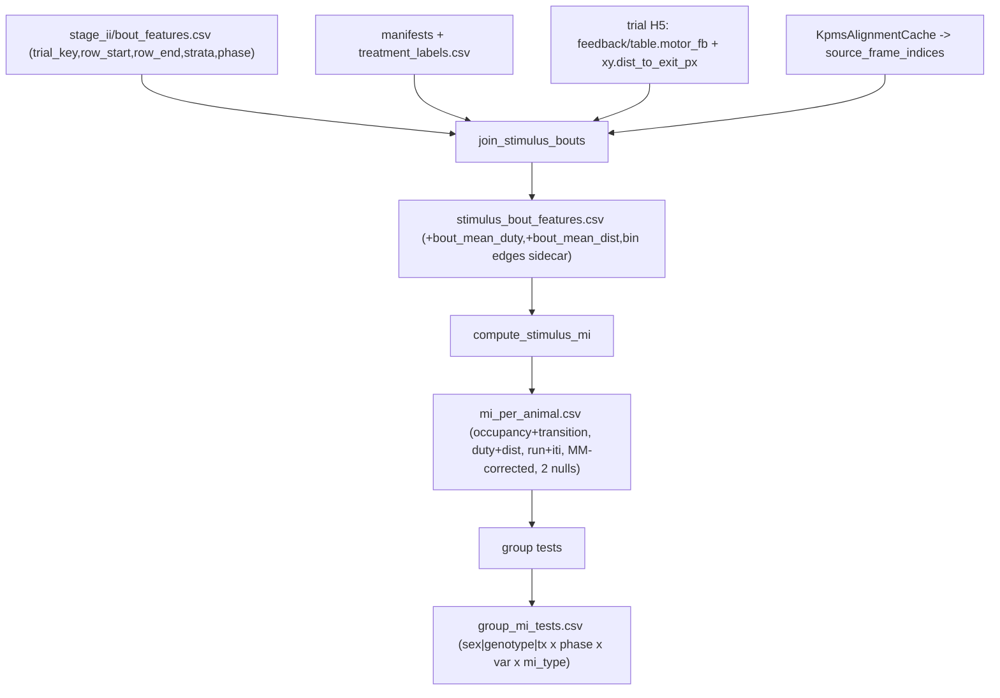

# Stimulus to syllable join + stimulus-conditioned mutual information

## Goal

Operationalize "does the animal's response to the VAST stimulus differ by sex/genotype/tx" as: mutual information between a per-bout stimulus state and syllable behavior, estimated per animal, tested across groups. Pilot on data already on disk; no acquisition change, no probe trial (confound acknowledged below).

## Domain terms (ubiquitous language, pinned this session)

- Stimulus intensity: delivered PWM duty, `feedback/table.motor_fb`. Distinct from its driver, distance-to-exit `xy.dist_to_exit_px`. Duty is a clamped monotone function of distance -> at saturation they diverge; both are carried.
- Bout: run-length run of one syllable id (`syllable_runs`, [bout_scalars.py](maze/kpms/behavior_ethogram/bout_scalars.py) line 22). Unit of analysis.
- Phase: `run` vs `iti_wait`, from `bout_primary_state` ([behavior_token_summarize.py](maze/kpms/behavior_ethogram/behavior_token_summarize.py) `bout_in_phase`, line 62). Duty is distance-proportional only in `run`; `iti` = fixed duty -> serves as negative control (MI must be ~chance).
- Occupancy MI: `I(syllable ; stimulus)` — does which syllable is active track stimulus.
- Transition MI: `I(next_syllable ; stimulus | current_syllable)` — does stimulus steer the next behavior beyond momentum.
- Stimulus state: quantile bin (global fixed edges across the filtered cohort) of duty (and, separately, distance).

Confound (state plainly in outputs): stimulus is a deterministic function of distance-to-exit, so any MI is equally "response to goal proximity." Cannot dissociate without a probe/omission trial. iti negative control + duty-vs-distance divergence are partial checks only.

## Data flow

## Stage 1 — stimulus/bout join

New lib `maze/kpms/behavior_ethogram/stimulus_join.py` + `stimulus_join_contract.py`; CLI `maze/cli/join_stimulus_bouts.py` (register `maze-join-stimulus-bouts`).

- Read `stage_ii/bout_features.csv` ([bout_feature_contract.py](maze/kpms/behavior_ethogram/bout_feature_contract.py) `BOUT_TABLE_FIELDS`): `trial_key`, `row_start`, `row_end_exclusive`, `bout_primary_state`, strata cols.
- Per trial, rebuild `source_frame_indices` via `KpmsAlignmentCache` (same pattern as [mine_syllable_grammar_candidates.py](maze/cli/mine_syllable_grammar_candidates.py) lines 128-146). `row_start/row_end_exclusive` index into these kpMS rows.
- Read per-frame `motor_fb` (`feedback/table`) and `dist_to_exit_px` (xy table, [schema.py](maze/core/schema.py) line 15) from the trial H5; map to kpMS rows through `source_frame_indices` (reuse `trial_state_for_rows` mapping style, [bout_kinematics.py](maze/kpms/behavior_ethogram/bout_kinematics.py) line 93).
- Per bout: `bout_mean_duty`, `bout_mean_dist_px` = mean over `[row_start:row_end_exclusive]` (also keep entry value for later, not required now).
- Output `stimulus_bout_features.csv` = bout identity + strata + phase + the two stimulus scalars.
- Config-driven filters (CLI args, defaults chosen): `--experiment VASTcont,VASTalt`, `--drop-strain ?,''` (keep wt/tg), `--drop-blank-sex`, `--tx` passthrough. Fail-fast on unmapped strain.
- Verification step (read one VASTcont + one VASTalt trial H5): confirm `feedback/table.motor_fb` path and `dist_to_exit_px` populated for this cohort before coding the reader.

## Stage 2 — mutual information per animal

New lib `maze/kpms/behavior_ethogram/stimulus_mi.py` + contract; CLI `maze/cli/compute_stimulus_mi.py` (register `maze-compute-stimulus-mi`).

- Global fixed quantile bin edges over the filtered cohort (run bouts), separately for duty and distance; `--n-bins` default 4. Write edges to a sidecar so results are reproducible. Report per-animal `H(stim)` alongside MI (global edges leave it variable).
- For each `(animal, phase in {run, iti}, stim_var in {duty, dist})`:
  - Occupancy MI `I(syllable_id ; stim_bin)`, plug-in + Miller-Madow correction.
  - Transition MI `I(next_syllable ; stim_bin | current_syllable)` over consecutive bout pairs within trial.
  - Nulls (both, n_perm=1000): circular time-shift of the per-bout stimulus series vs syllable series within trial (primary, conservative — preserves autocorrelation); bin-label permutation (loose upper bound). Emit z and p under each.
- Output `mi_per_animal.csv`: `animal_id, sex, strain(genotype), tx, phase, stim_var, mi_type, n_bouts, H_stim, H_syll, mi_raw, mi_mm, null_circ_mean, null_circ_p, null_perm_mean, null_perm_p`.
- iti rows are the negative control: flag if iti `mi_mm` clears the circular null (would signal a confound/bug in the join).

## Stage 3 — group comparison

Fold into `compute_stimulus_mi` or small `stimulus_mi_groups.py`.

- For each `factor in {sex, genotype(=strain), tx}` x `phase` x `stim_var` x `mi_type`: two-level `scipy.stats.mannwhitneyu` (`scipy` already in [pyproject.toml](pyproject.toml) line 12), Kruskal if >2 levels present.
- One MI value per animal -> group = distribution of n values; no pseudoreplication.
- Output `group_mi_tests.csv`: `factor, level_a, level_b, phase, stim_var, mi_type, n_a, n_b, median_a, median_b, stat, p`.

## Tests (synthetic, no cohort data)

`tests/test_stimulus_join.py`, `tests/test_stimulus_mi.py`:
- Monotone syllable<-stimulus map -> occupancy MI > 0; MM < plug-in.
- Independent streams -> MI within circular null band.
- Flat stimulus (iti-like) -> MI ~ 0 / null undefined handled.
- Bout row-range averaging correctness against a hand-built `source_frame_indices`.

## Deliverables

- 2 CLIs + libs + contracts, 3 CSVs (`stimulus_bout_features.csv`, `mi_per_animal.csv`, `group_mi_tests.csv`), bin-edge sidecar, docs contract md, tests. No new dependencies.

## Out of scope

Probe/omission trial; mixed-effects interaction model (chosen against for this pilot); higher-order (n>2) stimulus-conditioned grammar; per-frame grain.