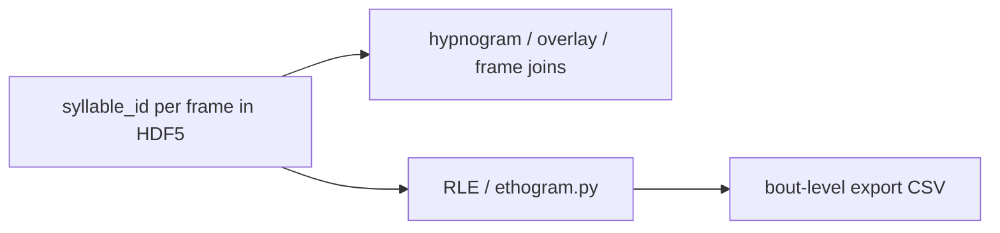
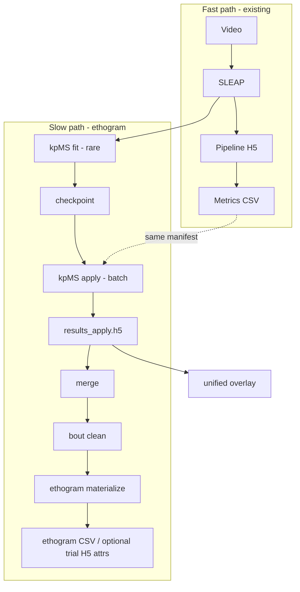

# Ethogram scope (Open EthoMaze)

**Status:** Pre-implementation scope (May 2026). Extends [rescue_plan.md](rescue_plan.md); does not replace ambulation/exploration as the primary contract.

---

## Product definition

| Layer | Contract today | Ethogram contract (target) |
|-------|------------------|----------------------------|
| **Input** | Video + strata labels | Same + SLEAP pose (required) |
| **Core metrics** | Ambulation & exploration (movement bouts, arms, objects, …) in pipeline HDF5 → long CSV | Unchanged |
| **Behavior labels** | Not in pipeline | **DB:** per-frame syllable id on the video/SLEAP timeline. **Export:** bout-level rows only (derived). |
| **Human QC** | QC images, mistrials | Hypnogram + exemplar tray (reads per-frame store); grid movies / similarity (CLI review) |
| **Publication / stats** | Trial-level CSV | Trial-level CSV **plus** bout-level ethogram CSV (no frame-grain export in v1) |

**Ethogram** here means: a time-aligned discrete behavior sequence over the trial (the “hypnogram” in `unified_overlay.py`), after optional **merge** (taxonomy) and **bout cleanup** (temporal rules)—not raw kpMS states before review.

---

## Storage vs export grain (decided)

| Layer | Grain | Rule |
|-------|-------|------|
| **HDF5 / database** | **Per frame** | One syllable label per source frame index (after merge/clean). Hypnogram, overlay, and future frame-wise joins read this. |
| **CSV / tables export** | **Per bout** | Contiguous runs of the same syllable id → one row (start/end frame, duration, id, optional name). **Derived** at export time via RLE; not stored as the canonical label stream. |

**Do not** ship a default frame-level ethogram CSV (too large, duplicates the DB). Frame dumps are debug-only if ever added.

### Canonical frame store (v1)

1. **Primary:** kpMS `results_*.h5` — per-recording `syllable` sequence (keypoint-moseq layout), after apply → optional merge → optional bout clean on that array.
2. **Alignment:** `maze.kpms.frame_alignment` maps each syllable row to **source video/SLEAP frame indices** (`source_frame_indices`); overlay already uses this pattern.
3. **Pipeline HDF5 (E4, recommended):** mirror into each trial group so ambulation XY and behavior labels share one file:
   - Group: `ethogram/` (under `/animal_id/session/trial/`)
   - Datasets (same length `T`):
     - `frame_index` — `uint32`, index into original video timeline
     - `syllable_id` — `int32`, `-1` = unlabeled / gap
   - Attrs: `kpms_results_path`, `kpms_model_name`, `kpms_recording_key`, `ethogram_stage` (`apply` | `merged` | `cleaned`), `fps`, provenance JSON pointer
4. **Bout table:** computed in memory (or cached CSV on disk); **not** written back as the authoritative label stream.



### E0 implementation note

- `maze/kpms/ethogram.py` — `syllable_frames_to_bouts(z, frame_index, fps)` → bout records (pure).
- `maze/kpms/materialize.py` — read frame store from results H5 → write **bout CSV** only; optional `write_ethogram_frame_datasets()` for pipeline H5 mirror (E4).

---

## What already exists (do not rebuild)

| Asset | Location | Role |
|-------|----------|------|
| Fit (slow, cohort) | `maze/kpms/fit.py` | Train checkpoint from manifest subset (`--max-trials`, stratified balance) |
| Apply (batch) | `maze/kpms/apply.py` | `results_apply.h5` via keypoint-moseq |
| Shared preprocess | `maze/kpms/preprocess.py` | Same inputs for fit and apply |
| Review | `scripts/kpms_review_artifacts.py` | Grid movies, trajectories, similarity CSV |
| Merge | `scripts/kpms_apply_syllable_merge.py`, `maze/kpms/syllable_merge.py` | Collapse syllable IDs |
| Bout cleanup | `scripts/kpms_clean_syllable_bouts.py`, `maze/kpms/syllable_bout_clean.py` | Temporal rules on label stream |
| Visualization | `maze/pipeline/viz/unified_overlay.py` | Hypnogram + syllable tray on video |
| Manifest bridge | `TrialManifest.kpms_recording_key`, `kpms_results_dict_key` | Links trial row → kpMS dict key |

**Gap:** No `run_pipeline` stage; no GUI workers; **no CSV/HDF5 ethogram export** in `maze/pipeline/exports/`; pipeline HDF5 contract (`h5_results_contract`) has no syllable datasets.

---

## Why fit feels “unpipelineable”

| Stage | Cost driver | Implication |
|-------|-------------|-------------|
| **Fit** | JAX Gibbs, many trials, GPU; minutes–hours | **Offline, rare** — per project/dataset, not per trial at acquisition |
| **Apply** | One checkpoint, batch over cohort; cheaper than fit | **Batch job** after pose exists; can rerun when manifest grows |
| **Merge + clean** | CPU, seconds–minutes per results file | **Cheap** — run after apply; version results (`results_apply.merged.h5`) |
| **Materialize export** | RLE on `z[]` | **Cheap** — should be deterministic library code |

**Do not** put fit on the critical path for ambulation CSV or live acquisition.

---

## Architecture: two pipelines, one manifest



**Orchestration principle:** same `TrialManifest` / manifest CSV as ambulation; ethogram stages are **optional** and **versioned** under `<project_dir>/<model_name>/`.

---

## Phased delivery (Phase E)

Runs **after Phase A** (tests, paths). Overlaps **Phase C** (GUI) for workers; does not block **Phase B** (HTTP).

### E0 — Contract & materialize (no GUI)

**Goal:** Define ethogram as a **published artifact**, not only a plot.

| Task | Deliverable |
|------|-------------|
| E0.1 | `maze/kpms/ethogram.py` — bout derivation from per-frame `syllable_id` + `frame_index` (RLE); no bout store in HDF5 |
| E0.2 | `maze/kpms/materialize.py` — read frame labels from results H5; emit **bout-level CSV** + sidecar manifest |
| E0.3 | Column spec (export): `animal_id`, `session`, `trial`, `bout_index`, `syllable_id`, `syllable_name?`, `start_frame`, `end_frame`, `duration_s`, `n_frames`, `recording_key` |
| E0.4 | Tests: synthetic per-frame `z[]` + `frame_index` → bouts; round-trip frame bounds; no GPU |
| E0.5 | (E4) `write_ethogram_to_trial_group()` — copy `frame_index` + `syllable_id` into pipeline trial `ethogram/` |

**Acceptance:** `uv run python -m maze.kpms.materialize --results-h5 ... --manifest-csv ... --out-dir ...` produces CSV joinable to trial summary on `(animal_id, session, trial)`.

### E1 — Apply pipeline (batch, not fit)

**Goal:** “New trials with pose → ethogram labels” without refitting every time.

| Task | Deliverable |
|------|-------------|
| E1.1 | CLI `maze-kpms-apply` (or script promotion) wired in docs as cohort step |
| E1.2 | Optional `scripts/cohort_ethogram.sh` / documented sequence: apply → merge? → clean → materialize |
| E1.3 | `apply_summary.json` + manifest hash (reuse Phase C `run_provenance.py`) |
| E1.4 | Skip-if-unchanged: if trial already in results and SLEAP mtime unchanged, skip (policy TBD) |

**Acceptance:** Adding trials to manifest + re-apply updates `results_apply.h5` and bout CSV without refit.

### E2 — Fit operations (slow path)

**Goal:** Make fit **schedulable and reproducible**, not interactive-blocking.

| Task | Deliverable |
|------|-------------|
| E2.1 | Document fit SOP: subset size, `--balance-by`, checkpoint guard (`--force-new`) |
| E2.2 | Phase C `KpmsFitWorker` — subprocess or thread with cancel + log file (hours OK) |
| E2.3 | Optional: fit job queue file (`fit_jobs.jsonl`) for overnight runs |
| E2.4 | HPC note: headless fit on GPU node; apply on CPU or GPU |

**Acceptance:** Lab can run fit overnight; apply + materialize next day on same manifest.

### E3 — Taxonomy & stable names (roadmap “sane classification”)

| Task | Deliverable |
|------|-------------|
| E3.1 | `syllable_labels.yaml` — map id → human name (arena/task specific) |
| E3.2 | Materialize includes `syllable_name`; merge meta JSON referenced in export |
| E3.3 | GUI or script picker for merge spec after `kpms_review_artifacts` |

### E4 — Integration with fast pipeline (optional link)

| Task | Deliverable |
|------|-------------|
| E4.1 | Manifest columns: `kpms_model_dir`, `kpms_results_h5`, `ethogram_bouts_csv` |
| E4.2 | After apply/merge/clean: sync **per-frame** `ethogram/` datasets into pipeline trial H5 (see Storage vs export) |
| E4.3 | Export bundle: trial CSV + **bout** ethogram CSV in one `run_exports` pass (join on trial keys; frames stay in H5) |
| E4.4 | **Not in v1:** per-trial fit/apply inside `process_trial` |

### E5 — UX & observability

| Task | Deliverable |
|------|-------------|
| E5.1 | GUI: “Ethogram status” per cohort (no checkpoint / stale apply / ready) |
| E5.2 | Open overlay with kpMS layer from manifest pointers |
| E5.3 | Phase B `/orm/discover` — find `results_apply.h5` under data root (optional) |

### E6 — Multi-stream kpMS (experimental; after E0–E1)

**Goal:** Optional **additional** ethogram streams beyond SLEAP/DLC pose—not a replacement. Syllable IDs are **not comparable** across streams; each stream has its own checkpoint, `results_*.h5`, and bout CSV (provenance required).

| Stream | Pose source | Fit/apply | Caveats |
|--------|-------------|-----------|---------|
| **A — anatomical** | SLEAP (or DLC) → `STANDARD_NODE_NAMES` | Existing E1/E2 path | Needs well-trained CNN; `require_sleap=True` today |
| **B — blob poly** | Backup tracker contour → fixed-order pseudo-keypoints | Separate `blob_*` project dir + model | High subject/background contrast; orientation mostly **motion** (velocity sign on major axis); tail rarely reliable after morphology |
| **C — combined** | Concatenate A + B keypoints in one `bodyparts` list | Third checkpoint on fused coordinates | May stabilize when A and B fail on different frames; risk that model ignores B when A is strong—evaluate with ablation |

**Orientation (stream B):** Do not map blob nodes to `nose`/`tail`. Use a dedicated schema (e.g. `blob_c`, `blob_p0`…`blob_pN-1` on simplified contour, plus `blob_front`/`blob_back` from centroid ± k·velocitŷ with temporal unwrap and low-confidence when speed ≈ 0).

**H5 contract (prerequisite):** Persist full pose and blob polys in trial HDF5 so kpMS does not depend on `.slp` sidecars for controller-first data. See **`docs/h5_tracking_contract.md`** (`tracking/anatomical`, `tracking/blob`, schema `v2`). E6 apply reads H5 first; `sleap_path` remains provenance / legacy import only.

**Ops cost:** Three slow paths ⇒ three rare fits and three apply/materialize passes per cohort (unless lab defers B/C). Treat as research track until a spike shows combined bout stability beats A alone on held-out trials.

**Spike acceptance (before full E6):** On a small manifest subset, offline blob poly → `build_kpms_inputs`-style tensor → fit/apply B; compare bout duration distributions and overlay QC vs stream A only; only then fit stream C on concatenated coordinates.

---

## Recommended order vs rescue plan

| Rescue phase | Ethogram interaction |
|--------------|---------------------|
| **A** | Tests for E0 RLE/materialize can land in A3 if scoped small |
| **B** | Optional discover of kpMS artifacts |
| **C** | C4/C5 kpMS fit/apply GUI = **E2/E1** UI |
| **D** | Promote materialize CLI; AGENTS.md ethogram SOP |
| **E** | **E0 → E1 → E2 → E3 → E4 → E5**; optional **E6** spike after E1 gate |

**Start ethogram coding at E0** in parallel with **PR-A3** only if tests infra exists; otherwise **E0 immediately after Phase A gate**.

---

## Open decisions (need lab input)

1. ~~**Export grain**~~ — **Resolved:** bout-level CSV export; per-frame in HDF5 only.
2. **Mirror policy:** frames only in `results_*.h5` vs also copy to pipeline trial `ethogram/` after each apply (recommended for single-file science audits).
3. **Refit policy:** refit never / refit quarterly / refit when N new trials > threshold?
4. **Task scope:** one kpMS model per task (VAST vs RAM vs NOR) or one merged model?
5. **Controller-first:** ethogram only on experimental trials with SLEAP, or include habituation?
6. **E6 multi-stream:** pursue blob + combined streams after E1, or defer until anatomical ethogram is routine?
7. ~~**H5 tracking v2**~~ — See `docs/h5_tracking_contract.md`: canonical file = acquisition `trials.h5` when controller-first; no default mirror; pose default `keep_live` with explicit overwrite UI; blob `N=8` in `maze.core.anatomy`.

---

## Success criteria (ethogram “works”)

- [ ] Cohort with pose can run **apply → materialize** without refit.
- [ ] Per-frame syllable ids live in HDF5 (results and/or pipeline `ethogram/`); bout CSV is derived only.
- [ ] Bout CSV joins to ambulation trial CSV on trial keys.
- [ ] Unified overlay and exports reference the **same** results file (post-merge/clean documented).
- [ ] Fit is documented as **rare**; not required for daily metrics.
- [ ] One page SOP in `AGENTS.md` / `docs/ethogram_scope.md` (this file).

---

## Prompt template (new Agent chat)

```text
Scope: Phase E0 only (docs/ethogram_scope.md).
Implement maze/kpms/ethogram.py (RLE: frames → bouts) + materialize CLI (bout CSV only).
Read per-frame syllable from results_apply.h5; do not export frame-grain CSV.
Do not change run_pipeline or GUI. Controller-first workflow.
```
