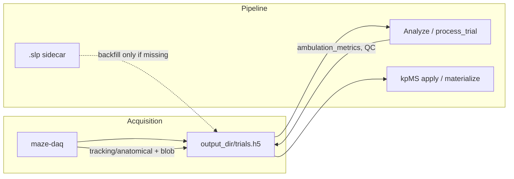

# H5 tracking contract (controller-first, kpMS-ready)

**Status:** Design target (May 2026). Complements [ethogram_scope.md](ethogram_scope.md) E6 and [h5_results_contract](../maze/pipeline/h5_results_contract.py).

## Problem

Today:

| Data | Where it lives | Gap |
|------|----------------|-----|
| Spot / in-range / centroid | `ambulation_metrics/<point>/xy` (per-frame `XY_ROW_DTYPE`) | Written at acquisition; enough for ambulation, not full pose |
| SLEAP/DLC full skeleton | External `.slp` / `.h5.slp` via `trial.attrs["sleap_path"]` | kpMS `build_kpms_inputs` **requires** sidecar; controller-first trials may have live pose never persisted |
| Blob silhouette | Ephemeral `blob_mask` in GUI only | Not in H5; E6 blob stream has no canonical source |

**Goal:** One trial HDF5 is the **authoritative timeline** for downstream kpMS (streams A/B/C), overlay, and audits. Sidecar prediction files remain optional imports or backups, not the only source of truth.

## Schema version

Bump `metadata/controller_schema_version` from `v1` → **`v2`** when `tracking/` groups are written.

Readers must accept `v1` files (no `tracking/` → legacy sleap_path + ambulation spot tables only).

## Trial layout (additive)

Under `/animal_id/session_id/trial_id/`:

```
tracking/
  anatomical/          # SLEAP, DLC, or equivalent full skeleton
  blob/                # backup contour pseudo-keypoints (E6 stream B)
ambulation_metrics/    # unchanged role: derived metrics + controller spot paths
ethogram/              # E4: per-frame syllable_id per stream (optional)
```

Do **not** overload `ambulation_metrics` with eight separate full-length node tables (loses scores, duplicates storage). Use dense `tracking/anatomical` for kpMS.

---

## `tracking/anatomical`

Dense per-frame pose aligned to the **acquisition video timeline** (same `frame_index` semantics as `ambulation_metrics/*/xy`).

| Dataset / attr | Shape / type | Notes |
|----------------|--------------|-------|
| `frame_index` | `(T,) uint32` | Index into source video; monotonic within trial |
| `x`, `y` | `(T, K) float32` | `NaN` where missing |
| `score` | `(T, K) float32` | Confidence; 0 where absent |
| `valid` | `(T, K) uint8` | Optional explicit mask (else derive from finite xy + score threshold) |
| Attr `node_names` | JSON list[str] | Order matches K; prefer `STANDARD_NODE_NAMES` subset/order when possible |
| Attr `pose_source` | str | `sleap_live` \| `sleap_import` \| `dlc_import` |
| Attr `pose_model_path` | str | Checkpoint or `.slp` used (provenance) |
| Attr `fps` | float | Same as video / ambulation tables |

**Write paths**

1. **Acquisition (controller-first):** each camera tick with SLEAP enabled, append row from `pose_xy` / `pose_scores` / `pose_node_valid` (after jump filter policy used for display).
2. **Import / analyze:** `process_trial` or a dedicated `persist_pose_to_h5` step after `load_sleap_file`, if `tracking/anatomical` missing or `overwrite_pose=true`.
3. **Virtual acquisition / batch inference:** write here when promoting predictions into controller DB.

**Read priority for kpMS** (`build_kpms_inputs` future behavior):

1. `tracking/anatomical` in the **canonical trial H5** for that manifest row (see below).
2. Else `manifest.sleap_path` (legacy sidecar).
3. Else skip trial with reason `missing_pose`.

`TrialManifest.sleap_path` becomes a **provenance pointer**, not a hard dependency.

---

## `tracking/blob`

Backup-tracker polygon for E6 stream B. **Fixed `N = 8`** (`maze.core.anatomy.BLOB_VERTEX_COUNT`, names `BLOB_NODE_NAMES`) to match anatomical keypoint count. Resample contour to eight vertices; canonical order from motion heading (see ethogram_scope E6). Do not add a separate profile knob yet—keep constants beside `STANDARD_NODE_NAMES` in `anatomy.py`.

| Dataset / attr | Shape / type | Notes |
|----------------|--------------|-------|
| `frame_index` | `(T,) uint32` | Same timeline as anatomical / video |
| `xy` | `(T, N, 2) float32` | Polygon vertices in full image px; `NaN` if no blob |
| `valid` | `(T,) uint8` | 1 if blob found |
| `heading_rad` | `(T,) float32` | Motion-based front axis; `NaN` when speed below epsilon |
| `score` | `(T,) float32` | Frame-level quality (area, circularity, stability) |
| Attr `n_vertices` | int | Always `8` (redundant with `BLOB_VERTEX_COUNT`; stored for HDF5 self-description) |
| Attr `blob_source` | str | `backup_live` \| `offline_retrack` |
| Attr `backup_params_json` | JSON | Frozen `range_low/high`, `min_area`, morph kernel, ROI — for reproducible offline re-track |
| Attr `node_names` | JSON | `BLOB_NODE_NAMES`: `blob_p0`…`blob_p7` — **not** anatomy names |

**Write paths**

1. **Acquisition:** when backup tracker valid, simplify `blob_mask` contour → `N` vertices; compute heading from centroid velocity.
2. **Offline:** re-run `AdaptiveThresholdTracker` on stored video using `backup_params_json` when live recording absent (legacy trials).

---

## `ethogram/` (E4, per stream)

Mirror [ethogram_scope.md](ethogram_scope.md): `frame_index`, `syllable_id`, attrs `kpms_model_name`, `ethogram_stage`, **`pose_stream`** = `anatomical` \| `blob` \| `fused`.

One trial may hold multiple ethogram groups, e.g. `ethogram/anatomical/`, `ethogram/blob/`, `ethogram/fused/`.

---

## Implementation phases (suggested)

**Agent-assignable slices:** [tracking_kpms_master_plan.md](tracking_kpms_master_plan.md) and [phase_t_agent_prompt.md](phase_t_agent_prompt.md) (one PR per slice).

| Phase | Scope |
|-------|--------|
| **T0** | This doc + schema constants in `maze/core/schema.py`; contract tests (round-trip write/read) |
| **T1** | Acquisition: `TrialRecorder` buffers + flush `tracking/anatomical` + `tracking/blob` at `stop()` |
| **T2** | `maze/kpms/preprocess.py`: `load_pose_from_trial_h5()`; manifest `require_sleap` relaxed when H5 pose present |
| **T3** | `process_trial`: backfill anatomical from sidecar when H5 pose missing; `keep_live` overwrite UX |
| **T4** | Multi-stream kpMS: blob (B) + fused (C) + `--pose-stream` CLI |
| **T5** | E6 spike: bout stability A vs B vs C on held-out subset |

## Backward compatibility

- **v1 trials:** unchanged; kpMS and pipeline keep using `sleap_path`.
- **Discovery:** `sleap_path` column optional when `has_tracking_pose` attr or manifest flag set.
- **File size:** `(T, K)` float32 ≈ 8×T×K bytes per trial; acceptable vs duplicating video; use gzip on datasets.

## Resolved decisions (lab, May 2026)

### 1. Canonical HDF5 file (elaboration)

The repo already supports **one file** or **two files** per cohort. Tracking v2 must behave correctly in both without silently duplicating or forking pose.

| Deployment | Typical paths | What happens today | Canonical for `tracking/` + kpMS |
|------------|---------------|--------------------|----------------------------------|
| **Controller-first (usual)** | `output_dir/trials.h5` only | Acquisition writes trials; Analyze / Discovery use **the same** `db_path`; `input_h5_path` empty on manifest ⇒ controller-style prefilter | **That file** — e.g. `D:\scratch\trials.h5` |
| **Controller + central results** | `output_dir/trials.h5` + `outputs/maze_results.h5` (or lab `OUTPUT_H5`) | Discovery sync registers trials in central DB; attrs may point at videos/sidecars under `output_dir` | **The file that contains the trial group with `tracking/anatomical`** — implementers must not assume central DB if pose only exists in acquisition file |
| **Legacy import** | Legacy input H5 + separate results H5 | `input_h5_path` set; pose from sidecar `.slp`; controller spot tables may be absent | **Results H5** after backfill; sidecar fills `tracking/anatomical` on first analyze if missing |

**Rules (target implementation):**

1. **Write at source:** `tracking/anatomical` and `tracking/blob` are written where acquisition (or virtual acq) already writes the trial group — normally `default_results_h5_path(config)` (`maze/pipeline/controller_discovery.py`).
2. **Read for kpMS / overlay:** Resolve canonical path per manifest row: `TrialManifest.input_h5_path` if it exists and contains `tracking/anatomical`; else the results `db_path` passed to apply/materialize; else `sleap_path` sidecar.
3. **No automatic full-file mirror** on Analyze: `process_trial` **updates the same trial group in the `db_path` it was given** (adds ambulation metrics, QC, optional backfill). It does not copy whole trials into a second H5 unless the user runs an explicit export/sync tool (future: optional “copy tracking into cohort DB” batch — out of v2 default).
4. **Discovery sync** continues to set `video_path`, `sleap_path`, `input_h5_path` attrs on the target DB; when controller-first, `input_h5_path` should reference the acquisition file if trials are analyzed from a different results file, so kpMS can find pose without rescanning disks.



**Why not always mirror into a second H5?** Duplication risks drift (live pose in A, batch SLEAP in B), doubles storage, and confuses provenance. One authoritative trial group per logical trial is enough if readers follow the resolution rules above.

### 2. Pose overwrite policy (default + UX)

| Priority | Source | `pose_source` attr |
|----------|--------|-------------------|
| **Default (keep)** | Live acquisition buffer flushed at trial `stop()` | `sleap_live` |
| **Import only if allowed** | Batch / Analyze backfill from `.slp` / DLC | `sleap_import` / `dlc_import` |

**Default behavior:** If `tracking/anatomical` already exists with `pose_source=sleap_live`, **do not overwrite** on analyze or batch inference unless the user explicitly opts in.

**User-visible control (required for v2):**

- Settings or Analyze dialog: **“Replace recorded live pose with file predictions”** (danger-styled or confirm checkbox).
- Status bar / trial summary after analyze: e.g. `Pose: live (8 nodes, 2400 frames)` vs `Pose: imported from …slp (overwrote live)` vs `Pose: live kept; import skipped`.
- Persist choice on trial or session attrs: `pose_overwrite_policy` = `keep_live` \| `prefer_import` (default **`keep_live`**).
- Log line + optional `tracking/anatomical` attr `pose_superseded_at` / `pose_superseded_by` when overwrite happens.

Rationale: Live pose matches what the operator saw (jump filter, ROI crop, hybrid fallback timing). Sidecar batch runs often use different crops, models, or frame windows—useful for science, but must not silently replace the acquisition record.

### 3. Blob vertex count

**Fixed 8** for v2, parity with `len(STANDARD_NODE_NAMES)`. Names: `maze.core.anatomy.BLOB_NODE_NAMES` (`blob_p0`…`blob_p7`). Change only alongside a schema bump and anatomy constants—not a scattered GUI default.

## Open decisions (remaining)

1. **DLC:** same `tracking/anatomical` layout with `pose_source=dlc_import` and DLC node name list?
2. **Cross-DB pointer:** when results H5 ≠ acquisition H5, store `tracking_source_h5` attr on trial group vs rely on manifest `input_h5_path` only?
