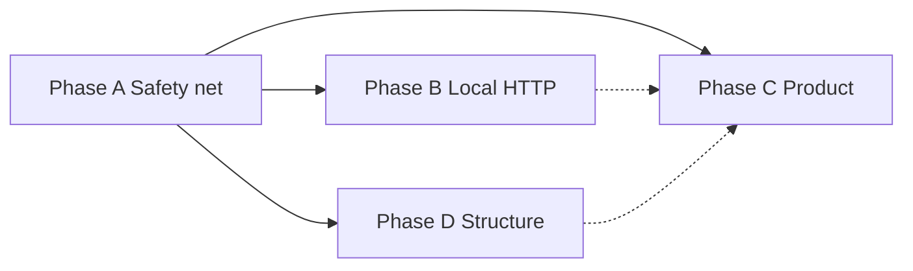

# OpenEthoMaze rescue plan (master)

**Verdict:** Rescue incrementally — do not rebuild. This document merges Phase A–D plans produced by delegated exploration subagents (May 2026).

**Related:** [roadmap.md](roadmap.md), unified HTTP plan at `.cursor/plans/unified_local_http_service_57353264.plan.md`.

---

## Overview

| Phase | Goal | Duration (rough) | Blocks |
|-------|------|------------------|--------|
| **A** | Stop the bleeding: tests, CI, deps, paths | 1–2 weeks | — |
| **B** | Unified localhost HTTP (`/orm/*` + h5web) | 1–2 weeks | A (tests + `local-service` extra) |
| **C** | Product narrative: re-enable pipeline GUI, kpMS fit | 2–4 weeks | A; B optional |
| **D** | Structural paydown: GUI split, AGENTS, scripts | Ongoing after A | A tests green per PR |
| **E** | Ethogram: materialize, apply batch, fit ops, exports | After A; overlaps C | See [ethogram_scope.md](ethogram_scope.md) |

---

## Delegation map (subagents)

Use `resume` with agent IDs to continue implementation in focused threads.

| Phase | Agent ID | Scope |
|-------|----------|--------|
| A | `6e35dbe4-743d-4847-94ac-c43a723ed4b6` | Tests, CI, pyproject extras, paths hygiene |
| B | `db6358f5-df99-4fc7-ad41-3a5fb627f4c6` | `local_service`, h5web refactor, `/orm/*` |
| C | `dd7ff43b-174c-4ce8-895a-af19af6dc384` | Discovery/inference menus, kpMS GUI, observability |
| D | `0bf9a04e-5796-4397-920c-6ff10661673a` | `main_window` split, AGENTS.md, scripts, cursor rules |

---

## Phase A — Stop the bleeding

**Objective:** Behavioral safety net and portable installs so later phases do not add decay.

### Tasks (ordered)

| ID | Task | Owner | Files |
|----|------|-------|-------|
| A1 | Un-ignore `tests/`; add `conftest.py` + first unit tests | Agent | `.gitignore`, `tests/**` |
| A2 | Neutral `paths.py` + `paths_local.example.py` | Agent | `maze/pipeline/paths.py`, `paths_local.example.py` |
| A3 | Remove lab defaults from `apply.py`, `legacy_db.py` | Agent | `maze/kpms/apply.py`, `scripts/legacy_db.py` |
| A4 | Split deps: lean core + `gui`, `sleap`, `local-service` extras | Agent + human `uv lock` | `pyproject.toml`, `uv.lock` |
| A5 | Fix README install lines | Agent | `readme.md` |
| A6 | 5–10 unit tests (see below) | Agent | `tests/test_*.py` |
| A7 | GitHub Actions: ruff, black, pytest | Agent | `.github/workflows/ci.yml` |
| A8 | Secondary path cleanup (JSON, profiles, script docstrings) | Human/Agent | `inputs/`, `maze/controller/profiles/` |
| A9 | Per-machine: copy `paths_local.example.py` → `paths_local.py` | Human | gitignored |

### First tests (pytest, no H5/video in git)

1. `parse_video_filename` / `parse_sleap_filename` — `file_discovery`
2. `trial_manifest_csv_row_values` — manifest CSV contract
3. `expand_filter_arg`, `filter_manifests_by_trial_selectors` — kpms apply
4. `canonical_ram_trial`, `TrialKey.path` — trial keys
5. `detect_trial_data_quality` — `trial_quality`
6. `trial_matches_frame_policy` — `trial_filters`
7. `filter_manifests` — kpms subset

### Acceptance (phase gate)

- `uv run pytest tests/ -q` passes on Ubuntu CI without GPU/GGUF
- `uv sync` (no extras) succeeds on CI
- No `E:\` / `IMPRESS` defaults in `maze/` library code
- `tests/` tracked in git

### PR sequence

1. **PR-A1:** A1 + A2 + A3 + `paths_local.example.py`
2. **PR-A2:** A4 + A5 + human regenerates lockfile
3. **PR-A3:** A6 + A7

### Tools / skills

- `debug-python` rules: `uv run ruff`, `pytest`, `black --check`
- **fix-ci** / **loop-on-ci** after workflows exist
- **review-and-ship** before merge

---

## Phase B — Unified local HTTP service

**Objective:** One long-lived Flask process: h5web + h5grove + `/orm/*` (discover, detect, health). See `.cursor/plans/unified_local_http_service_57353264.plan.md`.

**Current gap:** No `maze/controller/local_service/`; `waitress`/`llama-cpp-python`/`ultralytics` still in **main** deps (plan wants `local-service` extra).

### Tasks (ordered)

| ID | Task | Files |
|----|------|-------|
| B0 | Move heavy deps to `[optional-dependencies] local-service`; add `maze-local-service` script | `pyproject.toml` |
| B1 | `register_h5web_routes(app, ...)`; thin `create_app` | `h5web_server.py` |
| B2 | Path sandbox: `sandbox.py`, `glob_safe.py`, `config.py` | `local_service/` |
| B3 | `create_local_app`, waitress `__main__`, env/CLI | `local_service/app.py`, `__main__.py` |
| B4 | `GET /orm/health` | `routes/health.py` |
| B5 | `POST /orm/discover` (LLM JSON + sandbox; CI keyword fallback) | `llm.py`, `discover.py`, `routes/discover.py` |
| B6 | `POST /orm/detect` (optional YOLO) | `yolo.py`, `routes/detect.py` |
| B7 | Tests: sandbox + Flask client (no GGUF) | `tests/controller/local_service/` |
| B8 | GUI menu: subprocess launcher (optional v1) | `menus.py`, `local_service_launcher.py` |

### API summary

- `GET /orm/health` — version, roots, llm/yolo loaded flags
- `POST /orm/discover` — `{"query","limit"}` → globs + matches under data root
- `POST /orm/detect` — multipart image or JSON video path + frame index
- h5web unchanged: `/`, `/api/*`, `?file=<relative-to-H5_BASE_DIR>`

### Security (v1)

- Bind `127.0.0.1` by default
- All paths via `resolve()` + prefix check under `--data-root`
- LLM output: JSON only; capped globs/time/matches
- No auth v1 (localhost threat model)

### Phase gate

- Sandbox tests green in CI
- `uv sync --extra local-service` documented; CI does **not** require GGUF
- GUI ephemeral h5web still works (B1 backward compat)

### Open decisions (pick before B5)

1. Discover: strict LLM-only vs keyword fallback for CI
2. Symlink policy on Windows lab drives
3. GUI launcher default data root (dialog vs last output dir)
4. Port 8765 collision: fail vs auto-increment

---

## Phase C — Product narrative

**Objective:** Roadmap “single story” — pose → (fit) → apply → overlay → export — with gated features re-enabled safely.

### Prerequisites

- Phase A complete (tests, paths, extras)
- Phase B optional (h5web QA, future NL discovery assist)

### Tasks (ordered)

| ID | Feature | Key files | Menu/UI |
|----|---------|-----------|---------|
| C7 | Observability skeleton | **new** `run_provenance.py`; hooks in sync/workers/fit | JSON logs + git hash |
| C1 | Re-enable Discovery | `menus.py`, `pipeline_dialogs.py` | Remove `setEnabled(False)` on discovery |
| C2 | Virtual acquisition + backend combo | `pipeline_dialogs.py`, `inference_backend.py` | Enable inference; `get_backend(kind)` |
| C3 | Analyze prefilter UX | `pipeline_dialogs.py`, `run_pipeline.py` | Document `controller` mode |
| C6 | Treatment labels editor | `pipeline_dialogs.py`, optional editor module | Enable “Create new…” |
| C4 | kpMS fit GUI worker | **new** `kpms_fit_dialog.py`; extract `run_kpms_fit` from `fit.py` | New menu action |
| C5 | kpMS apply GUI worker | **new** `kpms_apply_dialog.py` | New menu action |
| C8 | QC at scale (stretch) | exports + new summary dialog | Post-C1–C3 |
| C9 | Overlay menu (optional) | `unified_overlay.py`, scripts | Doc + optional menu |

### Stays disabled (until preview parity)

| Item | Location |
|------|----------|
| SLEAP trace quality tab | `analysis_settings_dialog.py` tab index 1 |
| DeepLabCut backend | `DeepLabCutBackendStub` |
| kpMS apply confidence fragment filter | commented block in `apply.py` |

### Lab manual checklist

See Phase C subagent report §3 (Discovery sync, inference skip-existing, analyze prefilter, kpMS fit/apply artifacts, treatment CSV, provenance JSON).

### Open question

**Controller-first vs legacy-first workflow?** Affects Discovery defaults and docs (controller H5 vs `legacy_db.py`).

---

## Phase D — Structural paydown

**Objective:** Maintainability without big-bang rewrite — split `main_window.py` (~2627 lines), quarantine IMPRESS paths, agent docs.

### Prerequisites

- Phase A tests green **before each** extraction PR

### `main_window.py` split (PR order)

1. `legacy_exit_seed.py` (~70 lines, H5 path heuristics)
2. `preview_events.py` (eventFilter)
3. `profile_menu_actions.py`, `pipeline_menu_actions.py`
4. `status_and_config_sync.py`
5. `window_layout.py` (`__init__` UI build)
6. `camera_loop.py` (~750 lines — highest risk; last big chunk)
7. `trial_run_actions.py`

**Target:** `main_window.py` ~500–800 lines; helpers take `window: MainWindow`.

### Scripts classification

| Verdict | Examples |
|---------|----------|
| **Keep** | `legacy_db.py`, overlay scripts, kpms scripts |
| **Promote** → `[project.scripts]` | `reprocess_controller_h5.py`, `export_ram_trial_manifest_csv.py`; use `maze.kpms.fit`/`apply` entrypoints |
| **Archive** | `langfuse_demo.py` → `scripts/demos/` or archive |
| **Frozen** | `scripts/archive/**` (ruff excluded) |

Add `scripts/README.md` (maintained / promoted / archive).

### Deliverables

| Artifact | Path |
|----------|------|
| `AGENTS.md` | repo root (install, paths, tasks, prefilter_mode, testing) |
| Cursor rules | `.cursor/rules/openethomaze-*.mdc` (paths, gui-split, scripts, prefilter) |

### Phase D order after A

1. D1: `AGENTS.md`, `scripts/README.md`, cursor rules
2. D2: IMPRESS path quarantine in `kpms/`, `legacy_db`
3. D3: Script docstrings; archive langfuse demo
4. D4a–f: `main_window` slices (one PR each)
5. D5: Thin CLI promotion to `maze.cli`

---

## Cross-phase dependency summary

| Need | Provider |
|------|----------|
| Committed tests | A1 |
| CI gate | A7 |
| `local-service` extra | A4 / B0 |
| Path sandbox tests | A1 + B7 |
| Safe menu re-enable | A1, A2 |
| GUI subprocess for HTTP | B8 (after B3); prefer after D4 camera_loop stable |
| `register_h5web_routes` test | B1 + A1 |
| No IMPRESS in defaults | A2, A3, D2 |

---

## Recommended execution timeline

| Week | Focus | Outcome |
|------|-------|---------|
| 1 | Phase A PR-A1, PR-A2 | Tests exist; paths portable |
| 2 | Phase A PR-A3; start B0–B2 | CI green; sandbox module |
| 3 | Phase B B3–B7 | `maze-local-service` runnable |
| 4 | Phase C C7, C1, C2 | Discovery + inference on |
| 5+ | Phase C C4–C5; Phase D slices | kpMS GUI; smaller main_window |

---

## What we are not doing

- Full stack rewrite (Qt/HDF5/SLEAP/kpMS)
- LLM/YOLO inside Qt process (subprocess only)
- Enabling trace-quality tab before preview parity
- Editing `scripts/archive/` for new features

---

## Next actions (for Agent mode)

1. Execute **PR-A1** (un-ignore tests, paths, apply/legacy defaults).
2. Resume subagent `6e35dbe4-743d-4847-94ac-c43a723ed4b6` for implementation if splitting work across chats.
3. Answer open question: **controller-first vs legacy-first** lab workflow (affects C1 defaults).
4. Ethogram: see [ethogram_scope.md](ethogram_scope.md) — start **E0** (bout CSV materialize) after Phase A gate; fit stays offline (E2).

---

## Phase E — Ethogram (summary)

Full scope: **[ethogram_scope.md](ethogram_scope.md)**.

- **Not** blocking rescue A–D.
- **Core idea:** slow **fit** (rare) + batch **apply** (repeatable) + cheap **merge/clean/materialize** → bout-level ethogram CSV alongside ambulation metrics.
- **E0 first** (library + tests, no GUI): turns existing `results_apply.h5` into a joinable export.
- **C4/C5** in Phase C are the GUI face of **E1/E2**, not a separate science stack.
