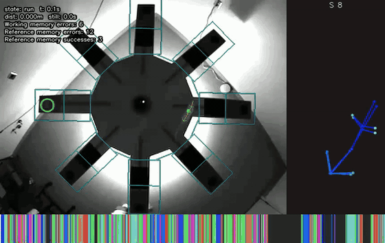
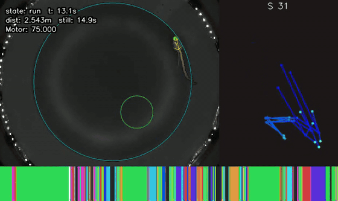

# Open Etho Maze

Data acquisition and processing for vision-based animal ethology: SLEAP pose tracking, keypoint-MoSeq, and maze metrics (ambulation, exploration bouts, arm entries, object investigations, etc.).

**Inputs:** video and strata labels  
**Outputs:** long-format CSVs of ambulation and exploration metrics

## Prerequisites

- Python **3.12** (managed by [uv](https://docs.astral.sh/uv/))
- Optional lab hardware: Vimba SDK (Allied Vision cameras), jumbo frames if your camera supports them, avrdude for firmware flashing

Install uv (PowerShell):

```powershell
powershell -ExecutionPolicy ByPass -c "irm https://astral.sh/uv/install.ps1 | iex"
```

## Install

From the repository root.

**Lean core** (pipeline, HDF5, scripts; no Qt, SLEAP, or local HTTP stack):

```bash
uv sync
```

**Typical lab workstation** (GUI + SLEAP inference + kpMS):

```bash
uv sync --extra gui --extra sleap --extra kpms
```

After changing the `sleap` extra or PyTorch pins, refresh CUDA wheels if needed:

```bash
uv sync --extra gui --extra sleap --extra kpms --reinstall-package torch --reinstall-package torchvision
uv run python -c "import torch; print(torch.__version__, torch.cuda.is_available(), torch.version.cuda, torch.cuda.device_count())"
```

**Local HTTP service** (waitress, optional LLM/YOLO; Phase B — not required for DAQ-only use):

```bash
uv sync --extra local-service
```

The unified service binds **127.0.0.1** by default (localhost only). Optional model paths:

| Variable | Purpose |
|----------|---------|
| `MAZE_LLM_GGUF` | Path to a GGUF file for `POST /orm/discover` (llama-cpp-python) |
| `MAZE_YOLO_WEIGHTS` | Default `.pt` weights for `POST /orm/detect` |
| `MAZE_YOLO_WEIGHTS_DIR` | Directory allowed for alternate YOLO weight files |

Run (core install includes h5grove; add `--extra local-service` for waitress):

```bash
uv run maze-local-service --data-root /path/to/cohort/root
```

Open h5web at `http://127.0.0.1:8765/?file=<path-relative-to-data-root>` (override host/port with `--host` / `--port`).

From the acquisition GUI (with `--extra gui` and `--extra local-service`): **File → Start local ORM service…** spawns the same process in a subprocess using the output folder (or last-used directory) as `--data-root`. Ephemeral **Open H5 in h5web** still uses a short-lived in-process server; the plan is to route h5web through the long-lived service only (see `docs/rescue_plan.md` Phase B decisions). Phase C work: `docs/phase_c_agent_prompt.md`.

**Development** (pytest, ruff, black, mypy, etc.):

```bash
uv sync --extra dev
```

Combine extras as needed, e.g. `uv sync --extra gui --extra sleap --extra kpms --extra dev`.

Per-machine data roots: copy `maze/pipeline/paths_local.example.py` to `maze/pipeline/paths_local.py` (gitignored) and edit paths.

After editing `pyproject.toml` dependency groups, regenerate the lockfile locally:

```bash
uv lock
uv sync
```

## Run acquisition GUI

From repo root:

```bash
uv run maze-daq
```

Modes:

```bash
uv run maze-daq --vast
uv run maze-daq --ram
uv run maze-ram-daq
```

Requires `--extra gui` (and usually `--extra sleap` for inference menus).

### Pipeline menu (GUI)

After `uv sync --extra gui --extra sleap`:

| Menu item | Purpose |
|-----------|---------|
| **Discovery…** | Scan acquisition **Output folder** for `{animal}_{session}_{trial}.mp4` and pose sidecars; sync paths into `trials.h5`. **Create new…** / **Open in editor…** for `treatment_labels.csv` (manual cohort labels; not HTTP discover). |
| **Virtual acquisition…** | Batch **SLEAP-NN** on trials with `video_path` in the results H5. Defaults: results H5 = `<output_dir>/trials.h5`, predictions under **Output folder**. |
| **Analyze…** | Run ambulation/QC on trials in `<output_dir>/trials.h5` with **`prefilter_mode=controller`** (GUI default). |
| **kpMS fit…** | Fit keypoint-MoSeq from a trial manifest CSV (`--extra kpms`; long-running QThread worker). Default project dir `<output_dir>/kpms`. |
| **kpMS apply…** | Apply a trained checkpoint to manifest trials (`--extra kpms`). Writes `results_apply.h5` and `apply_summary.json`. |
| **QC summary…** | Mistrial counts by reason, analyze/QC-image coverage, export `mistrial_summary.csv` with action hints. |
| **Render unified overlay…** | One-trial MP4 (video + pipeline H5 + optional kpMS). Requires OpenCV; CLI: `maze-render-trial-overlay`. |

#### Analyze prefilter modes (`run_pipeline` / `trial_filters`)

The GUI **Analyze** dialog always passes `controller`. CLI legacy batch uses `legacy`. Modes:

| Mode | Frame-diff filter | Mistrial preflight |
|------|-------------------|-------------------|
| **`controller`** | Off (all trials kept) | Off — allows x/y-only trials from acquisition H5 |
| **`legacy`** | On (task rules, e.g. VAST Δframes = −1) | On — skips missing video/SLEAP/H5 inputs |
| **`auto`** | Off for controller manifests* | Off for controller manifests* |

\*Controller manifests are detected when `input_h5_path` is empty in the trial manifest.

```bash
# Legacy cohort batch (strict preflight; hard-coded in maze-legacy-db run)
uv run maze-legacy-db run
```

**Skip existing (Virtual acquisition):** When enabled (default), a trial is not re-inferred if a pose file already exists at any of: the `sleap_path` stored in the H5, the planned `<output_dir>/<video_stem>.predictions.slp`, or `.predictions.slp` / `.slp` beside the video. The H5 `sleap_path` and model path are still updated from the file found; optional headless XY materialization runs if checked.

DeepLabCut and LLM/YOLO are not loaded in the Qt process (local ORM service uses a subprocess).

## Batch tools (CLI)

Implemented in `maze/cli/` and exposed as console scripts after `uv sync`. See [scripts/README.md](scripts/README.md) for the full list. Examples:

```bash
uv run maze-legacy-db init
uv run maze-legacy-db sync
uv run maze-render-trial-overlay --help
uv run maze-reprocess-controller-h5 path/to/controller.h5
```

kpMS tools need `--extra kpms`; SLEAP batch inference needs `--extra sleap`. Shims under `scripts/*.py` still work via `uv run python scripts/<name>.py` but prefer `uv run maze-<name>`.

## Demo




