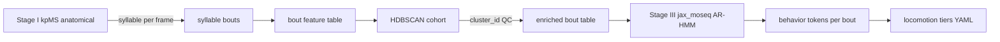

# Behavioral ethogram — greenfield plan (2026-06-24)

Grill **complete**. Glossary: [CONTEXT.md](./CONTEXT.md). ADRs: [docs/adr/](./docs/adr/).

## Pipeline



Phase III human naming → **deferred** (ADR 0009).

## Locked decisions (grill)

| # | Topic | Decision |
|---|--------|----------|
| 0001 | Pipeline | Three stages; Stage III = `jax_moseq.models.arhmm` |
| 0002 | Bout features | Scalar means/IQRs + duration; no curves |
| 0003 | Scope | Anatomical kpMS only; blob polygon for area scalar |
| 0004 | `cluster_id` | QC default; `--include-cluster-feature` optional |
| 0005 | Heading | `mean abs Δheading` default; `--include-heading-direction` optional |
| 0006 | Fit scope | **Single-model target**; interim per-seed default, `--pooled-cohort` experiment |
| 0007 | AR-HMM hypers | `num_states=20`, `nlags=2`, `kappa=50` (provisional), α/γ from FitConfig |
| 0008 | Trial scope | `all` phases; RUN filter at export only |
| 0009 | Naming | Defer Phase III |

## Stage III technical note

Use **`jax_moseq.models.arhmm`**, not `keypoint_slds`:

```python
from jax_moseq.models.arhmm import init_model, resample_model
# data["x"]: (n_trials, max_bouts, d_features), data["mask"]
```

## Implementation order (scratch → library)

1. `compile_bout_features.py` — scalar bout table (+ flags)
2. `cluster_bouts_hdbscan.py` — cohort `cluster_id`, all interim seeds
3. `fit_bout_arhmm.py` — Stage III Gibbs; single-model path when one checkpoint exists
4. `calibrate_locomotion_tiers.py` — on **behavior-token** centroids (port from archive)
5. Block ethogram exports — tier/token colors

## Flags summary

| Flag | Default |
|------|---------|
| `--include-cluster-feature` | false |
| `--include-heading-direction` | false |
| `--pooled-cohort` | false |
