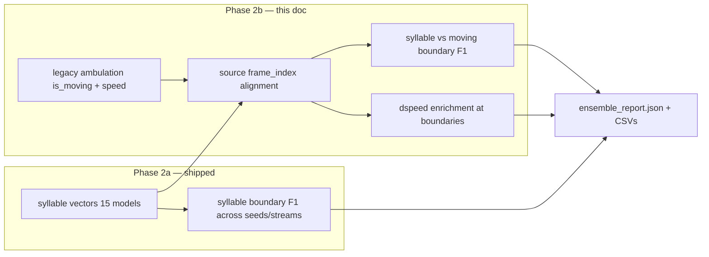

# Movement-correlation phase — plan & integration

**Status:** Implemented in scratch (`movement_layer.py` + `run_compare.py`).  
**Cohort:** `C:\Users\admin\Documents\work\sack\test`  
**Ambulation source:** `vast_results_legacy.h5` + `trial_manifest_legacy.csv` (mirrored legacy DB with `ambulation_metrics`).

`kpms_tracking.h5` has pose only — no `is_moving` / speed. Movement joins use the legacy results H5 on the same trial keys (`{animal_id}-{session}-{trial}`).

---

## 1. Goal

Relate **kpMS syllable bout boundaries** to **pipeline ambulation** (`is_moving`, speed) on a shared **source video timeline**, without comparing raw syllable IDs across models.

This answers:

| Question | Metric |
|----------|--------|
| Do syllable boundaries track movement on/off? | Boundary F1: syllable change points vs `is_moving` run boundaries |
| Are boundaries at speed kinks? | `mean |Δspeed|` at syllable boundaries vs non-boundary frames (ratio) |
| (Later) Do models agree on moving epochs? | Restrict syllable–syllable boundary F1 to frames with `is_moving==1` |

---

## 2. Timeline alignment (critical)

kpMS syllable vectors live on **preprocess-kept rows** (length `T`), not full video length.

```
video frame_index  ─────────────────────────────────────────►
                   │ skip │  kept + conf filter  │
                   └──────┴────────────────────────┘
                              │
                              ▼
kpMS row index     0   1   2  ...  T-1
syllable[t]        s0  s0  s1  ...  sK
```

**Per row `t`:**

1. Build `source_frames[t]` — same pipeline as fit/apply:
   - `build_kpms_inputs` keep-mask on `tracking/{stream}` in `kpms_tracking.h5`
   - `interpolate_nans_in_coordinates` + `filter_low_confidence_fragments` (conf ≥ 0.2, ≥3 keypoints)
2. Map `source_frames[t]` → legacy `ambulation_metrics/spot/xy` row by `frame_index` (fallback `centroid`).
3. Extract `is_moving[t]`, `speed_mps[t]` (m/s; xy px → m via trial `px_per_cm`) on the kpMS row axis.

**Boundaries are compared in source-frame space** (not row index), with tolerance **δ = 3 frames** (~100 ms @ 30 fps):

```
syllable_boundary_frames = source_frames[row where syllable changes]
moving_boundary_frames   = source_frames[row where is_moving changes]
F1 = match(syllable_boundary_frames, moving_boundary_frames, δ)
```

Row-index comparison would be wrong when ambulation spans full video but kpMS rows are a subset.

---

## 3. Data sources

| File | Role |
|------|------|
| `{stream}/seed_*/results_apply.h5` | Syllable vector per trial |
| `trial_manifest_kpms_tracking_wsl.csv` | Trial keys + `kpms_tracking.h5` path |
| `kpms_tracking.h5` | Pose + `frame_index` for alignment |
| `vast_results_legacy.h5` | `ambulation_metrics/{spot,centroid}/xy` with `is_moving`, `x`, `y`, `t_s` |
| `trial_manifest_legacy.csv` | Same cohort keys; used for provenance (join is by `animal_id` + session + trial) |

Speed is derived from ambulation XY: `speed = ‖Δ(x,y)‖ / Δt` on consecutive ambulation rows, then sampled at `source_frames[t]`.

---

## 4. Integration with bout-boundary ensemble compare



**How to read together:**

1. **High seed–seed boundary F1 + low moving F1** → models agree with each other but segment posture, not locomotion bouts (expected for fine syllables).
2. **High moving F1 + moderate seed–seed F1** → segmentation tracks movement; seed disagreement is mostly label identity / Gibbs noise.
3. **High `boundary_dspeed_ratio`** → syllable boundaries coincide with speed transients (kinematic change points).
4. **Outlier model** (e.g. incomplete `fused/seed_005`) → exclude with `run_compare.py --exclude-model fused/seed_005`.

---

## 5. Outputs

| File | Content |
|------|---------|
| `output/movement_correlation.csv` | Per-model medians: `boundary_vs_moving_f1`, `boundary_dspeed_ratio`, `mean_fraction_moving` |
| `output/trial_movement_correlation.csv` | Per trial × model (large; filter in pandas) |
| `output/ensemble_report.json` | Boundary + movement summaries |

---

## 6. Exclusions & known limits

- **`fused/seed_005`:** Fit did not complete (`fit_summary.json` / `results.h5` missing). Checkpoint exists but segmentation is invalid (median 24 bouts/trial vs ~164–185 for sibling seeds). Omit with `--exclude-model fused/seed_005` when running ensemble compare.
- **Cross-stream:** Movement join is per-stream (different `T` and keep-masks). Do not compare anatomical syllable boundaries to blob movement series directly.
- **Ambulation point:** Default `spot`; `centroid` fallback. Spot_hybrid/in-range not used in v1.
- **Trial state:** Ambulation XY includes all trial phases present in legacy H5; kpMS rows are run-phase pose frames. Small phase mismatch possible at trial edges — flag if F1 is unexpectedly low on short trials.

---

## 7. Run

```powershell
cd C:\Users\admin\code\OpenEthoMaze
uv run python scratch\kpms_ensemble_compare\run_compare.py
```

Requires `uv sync --extra kpms` (keypoint_moseq) and lab data paths above.

---

## 8. Future productization (T5c)

Promote to `maze-kpms-ensemble-compare`:

- `--legacy-db` / `--ambulation-point` CLI args
- H5 frame alignment helper in `maze/kpms/frame_alignment.py` (T5a blocker partially addressed in scratch)
- Optional: restrict analysis to `is_moving==1` frames for syllable–syllable agreement
- Optional: write `is_moving` into `kpms_tracking.h5` at build time to drop legacy dependency
