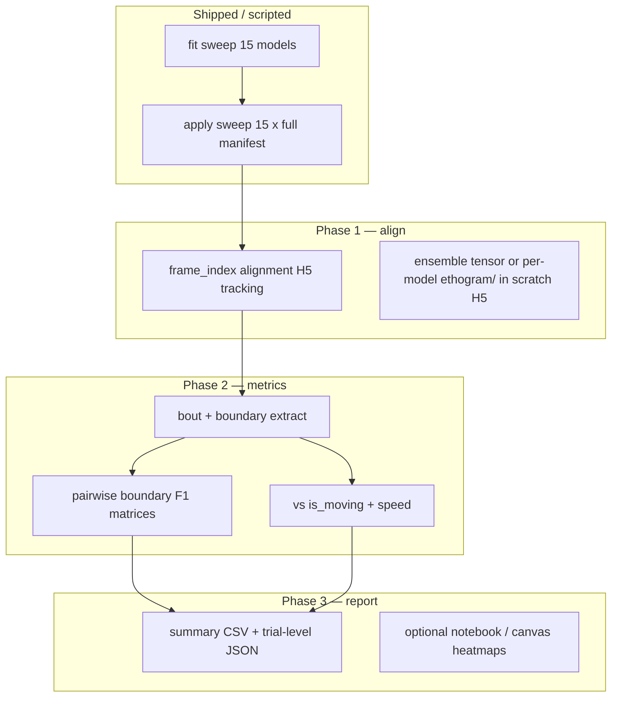

# kpMS ensemble compare — plan (15 models × full cohort apply)

**Context:** WSL fit sweep on MED-DavisData2 — 3 streams × 5 seeds → 15 checkpoints under `/home/data/test/<stream>/seed_<NNN>/`.  
**Goal:** Apply each model to tracking in `kpms_tracking.h5`, align per-frame labels on a common timeline, compare **segmentation** (not raw syllable IDs) and relate to **movement** (`is_moving`, speed).

**Scripts (now):**

| Step | Script |
|------|--------|
| Fit (running) | `scripts/wsl_kpms_multi_stream_fit_sweep.sh` |
| Apply (next) | `scripts/wsl_kpms_multi_stream_apply_sweep.sh` |
| Ensemble compare | `scratch/kpms_ensemble_compare/run_compare.py` |
| Wide CSV export | `scratch/kpms_ensemble_compare/export_wide_metrics.py` |

---

## 1. What you have after fit + apply

```
/home/data/test/
  anatomical/seed_{005,013,042,067,111}/
    checkpoint.h5          # trained model (80-trial fit subset)
    results.h5             # fit-set syllables (training cohort only)
    selected_trials.csv    # which 80 trials THIS seed picked
    results_apply.h5       # <-- target: full manifest cohort (after apply sweep)
  blob/...
  fused/...
```

**Important:** `--random-seed` affects **both** Gibbs init **and** stratified `--max-trials 80` selection. Different seeds → **different `selected_trials.csv`** even within the same stream. Apply still runs on the **full manifest** (all trials with H5 pose); that is normal (model trained on 80, labels everyone).

---

## 2. Syllable IDs — what is / is not comparable

### `num_states: 100` (`FitConfig`)

- Upper bound on **discrete HMM states** in the transition model, **not** the number of syllables you will see.
- After fit, `reindex_syllables_in_checkpoint` reorders labels **within one model** by usage (0 = most frequent).
- **Used syllable count K** varies by model (often ≪ 100).

### Cross-model label identity

| Comparison | Raw syllable ID comparable? | Why |
|------------|----------------------------|-----|
| Same stream, different seeds | **No** | Different Gibbs paths + often different 80-trial fit subsets |
| Different streams (A vs B vs C) | **No** | Different pose geometry; master plan marks streams incomparable ([tracking_kpms_master_plan.md](../../docs/tracking_kpms_master_plan.md)) |
| Same model, apply vs fit `results.h5` | **Yes** (same indexing) | Same checkpoint |

**Do not** compare “syllable 12” across models. **Do** compare **when** the label stream changes (boundaries) and **global** segmentation statistics.

Lowering `num_states` for future fits (e.g. 50–80) may reduce unused states but **does not** align IDs across runs.

---

## 3. Recommended comparison primitives

### A. Bout boundaries (primary)

For each trial and model, on a **shared `frame_index` timeline**:

1. Load `syllable[t]` from `results_apply.h5` (recording key = `{animal}-{session}-{trial}`).
2. Map rows → source frames via `tracking/anatomical.frame_index` in `kpms_tracking.h5` (same preprocess keep-mask as apply).
3. **Change points:** frames where `syllable[t] != syllable[t-1]` (optionally drop `-1` / gaps).

**Pairwise metrics** (models A, B on same trial):

| Metric | Notes |
|--------|--------|
| Boundary F1 @ ±δ frames | δ = 3–5 frames @ 30 fps (~100–170 ms); treat boundary sets as events |
| Jaccard on boundary frames | Strict (δ=0) |
| Mean |Δt| at matched boundaries | After optimal matching within δ |
| Fraction of boundaries shared | Within δ |

Aggregate: median over trials, then over model pairs → heatmaps (5×5 per stream, 15×15 across streams for boundary-only).

### B. Segmentation summaries (label-free)

Per trial / model (no ID matching):

- Number of bouts, bout duration distribution (KS test across models)
- Syllable occupancy entropy, max run length
- Total labeled fraction of trial

### C. Movement alignment (`is_moving`, speed) — **implemented (scratch)**

**Source data:** `kpms_tracking.h5` has pose only. For MED-DavisData2 use mirrored legacy DB:

- `vast_results_legacy.h5` — `ambulation_metrics/spot/xy` (`is_moving`, `frame_index`, `x`, `y`, `t_s`)
- `trial_manifest_legacy.csv` — same trial keys as kpMS manifest

See **[MOVEMENT_PHASE.md](MOVEMENT_PHASE.md)** for alignment plan, bout-boundary integration, and how to read boundary F1 vs movement F1 together.

**Scratch implementation:** `movement_layer.py` + `run_compare.py` → `output/movement_correlation.csv`.

**Excluded:** `fused/seed_005` (incomplete fit — missing `fit_summary.json` / `results.h5`; invalid segmentation).

### D. Optional: syllable trajectory similarity (within stream only)

`maze.kpms.review_artifacts` / `kpms.syllable_similarity` — compares **posture templates**, not IDs. Useful to cluster “equivalent” syllables **after** boundary agreement shows streams/seeds segment similarly. Defer until boundary pass looks sane.

---

## 4. Implementation phases



### Phase 1 — `maze-kpms-ensemble-stack` (new CLI, slice E6 / T5)

- Input: `--project-dir`, `--manifest-csv`, model list (auto-discover `*/seed_*/results_apply.h5`).
- For each trial in manifest ∩ all 15 results:
  - Build `frame_index` (uint32, length T = full trial or preprocess-aligned subset — **document choice**).
  - Load syllable vector per model; `-1` where model skipped trial.
- Output options:
  - **A:** `ensemble_compare.h5` — `/trials/{key}/frame_index`, `/trials/{key}/syllable/{model_id}` datasets.
  - **B:** CSV long format `(trial, frame, model_id, syllable_id)` for pandas (large).

**Code gap:** extend `maze/kpms/frame_alignment.py` for **H5 tracking** path (today SLEAP-centric); use `tracking/*/frame_index` + same keep-mask as `build_kpms_inputs`.

### Phase 2 — `maze-kpms-ensemble-compare` (metrics CLI)

- Read stacked H5 or scan 15 `results_apply.h5` directly.
- Emit:
  - `boundary_agreement.csv` — pairs × median F1 @ δ
  - `trial_boundary_agreement.csv` — per trial
  - `movement_correlation.csv` — boundary vs is_moving / speed stats
  - `syllable_count_summary.csv` — K used per model

### Phase 3 — Lab report

- Heatmaps: 5 seeds × 5 seeds within each stream; 3 stream blocks on diagonal only for boundary F1.
- Example trials: overlay boundary ticks for 2–3 models + speed trace (export PNG or unified_overlay later).
- **Three-stream trial overlay (scratch):** `visualize_three_stream_overlay.py` — anatomical / blob / fused hypnograms + `is_moving` + speed on shared `frame_index` (see example below).

```powershell
uv run python scratch/kpms_ensemble_compare/visualize_three_stream_overlay.py ^
  --trial-key 3243-S01-T01 --seed 042 ^
  --root C:\Users\admin\Documents\work\sack\test
```

Output: `scratch/kpms_ensemble_compare/output/overlays/<trial>_seed_<seed>.png`

### Wide worksheet export (scratch)

One row per (trial × stream × seed × metric); frame values padded to cohort max length.

```powershell
uv run python scratch/kpms_ensemble_compare/export_wide_metrics.py ^
  --root C:\Users\admin\Documents\work\sack\test ^
  --out scratch\kpms_ensemble_compare\output\ensemble_wide_metrics.csv
```

- **Metrics:** `syllable#`, `speed` (legacy ambulation on kpMS row timeline)
- **Models:** all discovered `*/seed_*/results_apply.h5` (use `--exclude-model` for bad fits)
- **Rows:** ~1,707 trials × 2 × 15 ≈ **51,200** (skips trials missing from `results_apply.h5` or ambulation)
- **Columns:** 10 metadata + `frame_1`…`frame_N` (N ≈ 6,030); within Excel limits

---

## 5. Decisions to make before coding metrics

| # | Question | Recommendation |
|---|----------|----------------|
| 1 | Compare on **full manifest** or **intersection of 80 fit trials**? | **Full manifest** for apply; for seed-sensitivity add secondary analysis on **intersection of all `selected_trials.csv`** |
| 2 | Frame timeline: full video length or preprocess-kept frames only? | **Preprocess-kept** (matches syllable vector length); map via `frame_index` |
| 3 | Boundary tolerance δ | Start **δ = 3 frames**; sensitivity at 1 and 5 |
| 4 | Include `-1` / unlabeled in boundaries? | **No** — boundaries only between valid labeled runs |
| 5 | `num_states` for next fit round | Try **60–80** if many empty states; log `K` in fit_summary |

---

## 6. Immediate ops (MED-DavisData2)

After fit sweep finishes:

```bash
cd /home/code/OpenEthoMaze
git pull   # apply sweep script + apply db_path fix
bash scripts/wsl_kpms_multi_stream_apply_sweep.sh
```

### Incremental: new animals (no re-fit)

**Do not re-run fit** — checkpoints are unchanged. Add trials to the tracking H5 on Windows, refresh manifest, then **append** apply for the new `animal_id`s only.

See [docs/wsl_kpms_setup.md](../../docs/wsl_kpms_setup.md) § Incremental cohort updates.

Sanity check one model:

```bash
uv run python -c "
import keypoint_moseq as kpms
r = kpms.load_results('/home/data/test/anatomical', 'seed_042')
print('recordings', len(r))
k = next(iter(r))
print(k, r[k]['syllable'].shape, 'unique', len(set(r[k]['syllable'])))
"
```

---

## 7. Open engineering tickets (from this plan)

1. **T5a** — H5 frame alignment in `frame_alignment.py` (blocker for H5-only cohort).
2. **T5b** — `maze/cli/kpms_ensemble_stack.py` + tests on synthetic 2-model fixture.
3. **T5c** — `maze/cli/kpms_ensemble_compare.py` boundary F1 + movement joins.
4. **Apply** — pass `db_path` in preprocess (done in `apply.py` for this branch).
5. **Fit** — expose `--num-states` CLI (optional; lower for next sweep).

---

## 8. Answers to your specific questions

> They should all emit the same number of syllables?

**No.** K (used labels) is empirical per model. `num_states=100` is only a capacity cap.

> No correlation of syllable numbers between models?

**Correct** for raw IDs. `reindex` only sorts **within** one checkpoint. Cross-model comparison must be **boundary-** or **distribution-based**.

> Compare bout edges?

**Yes — primary metric.** Optional: merge+clean bouts first (`syllable_bout_clean.py`) if short orphan runs dominate disagreement.

> Correlate is_moving and speed?

**Yes — secondary layer** after boundaries; requires deriving or importing movement signals onto the same `frame_index` axis.
